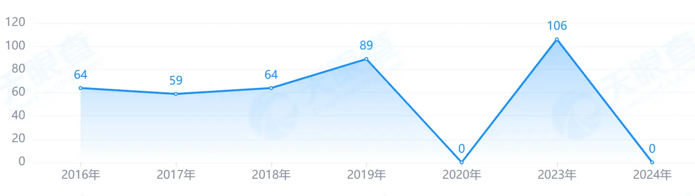
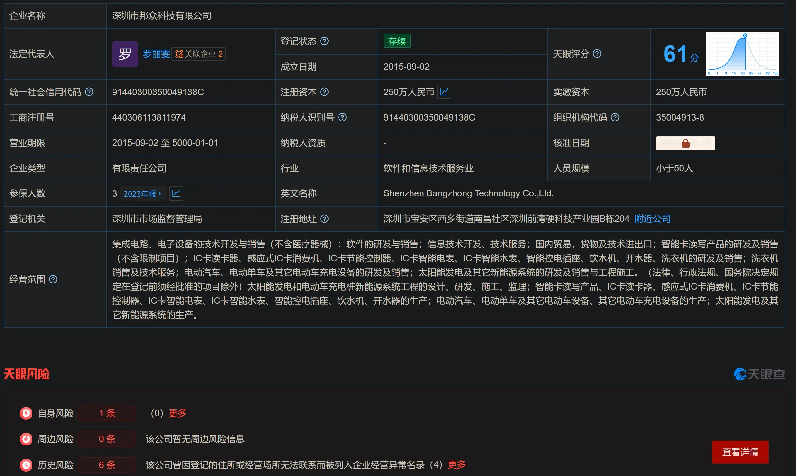
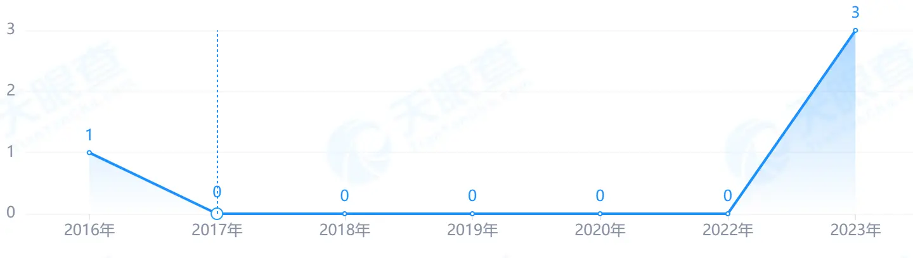
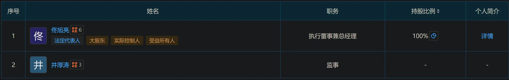
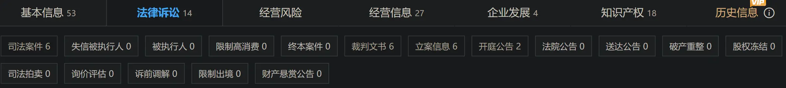
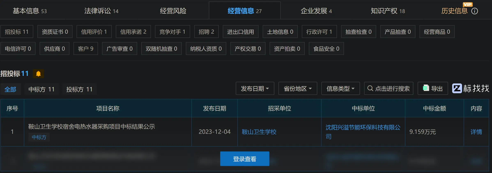
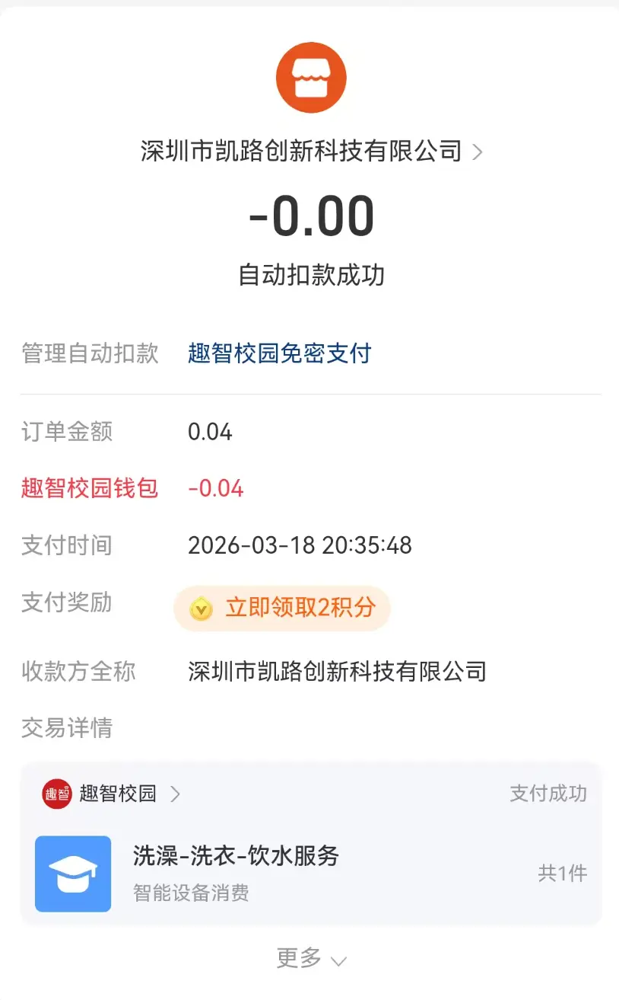

所有数据均来源于**天眼查、企查查等公开商业征信平台**，不代表个人主观臆断。

> [!quote]
> Rese Ase, [2025/9/19 18:32]
> 对了，最近我这遭遇了一次疑似诈骗
>
> Rese Ase, [2025/9/19 18:33]
> 是学校的水卡系统，天天要求绑定支卡通，最近一次弹窗说要刷脸认证，看起来很符合它天天整活要权限的尿性
>
> Rese Ase, [2025/9/19 18:33]
> 但是接下来就是一个类似视频通话的界面，要求我说话
>
> Rese Ase, [2025/9/19 18:34]
> 退出后是支付宝一个语焉不详的界面，说面部认证（具体名称我忘了，总之就是大部分严肃性认证和身份识别都有的那个刷脸）很有用
>
> Rese Ase, [2025/9/19 18:34]
> 然后水卡还能正常用
>
> Rese Ase, [2025/9/19 18:34]
> 吓得我赶紧把这个破小程序解约了
>
> Rese Ase, [2025/9/19 18:35]
> 小程序叫“趣智校园”
>
> Rese Ase, [2025/9/19 18:35]
> 你可以上小红书搜一下
>
> Rese Ase, [2025/9/19 18:35]
> 我大致浏览了一下，发现它就是个铺天盖地全是骂声的垄断产品
>
> Rese Ase, [2025/9/19 18:35]
> 想不明白我们学校为什么要改用它
>
> Rese Ase, [2025/9/19 18:36]
> 不过在这之前我就不怎么想用它了，它基本上每一步都会自动弹出或跳转到广告
>
> Rese Ase, [2025/9/19 18:36]
> 这只是让我自己买便携烧水瓶的导火索
>
> Rese Ase, [2025/9/19 18:54]
> 刚刚在校长直通车上投诉趣智校园了
>
> Rese Ase, [2025/9/19 18:56]
> 目前虽然我个人信息没泄露（除了对方可能录了我的人脸和声音信息），但是天天拿个350毫升的小水壶烧水，或者走4分钟去教学楼打水还是会比较麻烦。我挺希望学校把这个破玩意换下去的。一个从2023年开始就差评如潮的玩意他们居然2024年当新鲜玩意引进了……所以我感觉换下去的可能比较小，去年这个时候它才刚取代原有的、校园网内部的水卡系统。
>
> Rese Ase, [2025/9/19 18:56]
> 唯一可能让对面觉得这不是正经投诉的是我用了化名，但是它只说姓名一栏必须填，没说必须实名。我没写匿名已经够给面子了（）

是的，趣智校园水卡系统已经不满足于弹窗广告了。它开始弹窗诈骗了。具体的问题已在上方阐述完毕，接下来是趣智校园本体的问题。如果需要更具体的信息，那就是我直接注销了趣智校园账号，1.44元送它了——理由是小红书上一群没法把账户余额转回支付宝的毕业生，我干嘛还要费这个劲。以及B站上也全是骂的。

在黑猫投诉上，我们可以看到一堆有关不给退款或乱扣费的投诉，以及“未匹配”，即这么有名、这么多大学都在用的水卡软件所在公司，居然在黑猫投诉上仍未被匹配。当然这可能是因为没多少大学生在黑猫投诉上投诉它，才没对上：近30天共23起，已回复、完成4起；累计1436起，已回复、完成317起。

我们知道它是 `深圳市凯路创新科技有限公司`的产品。在高德地图上，我们可以看到，它位于深圳市宝安区西乡街道南昌社区深圳前湾硬科技产业园B栋203。不是什么有用信息，除非你准备送他们一发炸弹。而且全部七条评论无一例外都是一星，充值不可以退款、大学生使用等说明了大部分人和我一样，认为它没有不要脸到把这个公司名字拿上来顶包，自己则是个不知名躲在背后的“垄断企业”。或者说，大部分人不觉得它会是个顶在前面承受骂名的空壳公司。

其实目前我已经想得出它靠各种广告以及充值不退费集资的结论了。但是出于好奇心以及马原老师把任何理论讲得极其无聊甚至无意义的能力，我准备去天眼查上看一看。我看见前座同学在玩《丝之歌》了，看来大家都觉得我们老师讲得不好。

统一社会信用代码：91440300785290334Q

法定代表人：[曹成文](https://www.tianyancha.com/human/1965505567-c1433590824 "曹成文")

关联企业2：没开会员目前查不到，所以等我。核准日期同理。

注册资本：1,000万人民币

成立日期：2006-03-09

工商注册号：440301102982131

参保人数：0。人员规模：0人（看到这条时我真不知道该说什么了。难道真是空壳公司？集资来的？）

目前主要人员2人：

1. 曹成文，法定代表人，受益所有人，实际控制人，控股股东，职务为执行董事、总经理，持股比例81%
2. 罗丽雯，职务为监事，持股比例19%。难道说另一

注册资本：1000万人民币
实缴资本：1000万人民币

纳税人识别号：91440300785290334Q
纳税人资质：一般纳税人
组织机构代码：78529033-4
营业期限：2006-03-09 至 5000-01-01
企业类型：有限责任公司
行业：计算机、通信和其他电子设备制造业
登记机关：深圳市市场监督管理局
注册地址：深圳市宝安区西乡街道南昌社区深圳前湾硬科技产业园B栋203（一照多址企业）

电话：0755-26462125，通电话企业有两个，不出意外是法定代表人关联的另一个企业也在用。
邮箱：[584607740@qq.com](mailto:584607740@qq.com)
网址：www.klcxkj.com

好吧，这么看来用不着寄炸弹了。这给我的教训是学校有什么垄断性小日常软件/小程序时，先查查它背后的企业，不是啥正经玩意就赶紧违反校规找替代品。另外我在注册国家企业信用公示平台时一直提示网络超时，所以就还用天眼查了。

趁着我还在思考要不要开会员，我顺手去裁判文书网上搜了一下。有该公司与李伟兰、金飞二人的劳动争议案件。

> [!quote]-
> 李伟兰申请再审称：凯路公司应向李伟兰支付违法解除劳动关系赔偿金83096元，二审判决认定事实不清，适
> 用法律错误，请求撤销二审判决，立案再审本案。
> 凯路公司提交书面意见称：二审判决认定事实清楚，适用法律正确，李伟兰的再审申请缺乏依据，请求驳回李
> 伟兰的再审申请。
> 本院经审查认为，根据李伟兰申请再审的事由分析，本案争议的焦点在于凯路公司应否向李伟兰支付违法解除劳动关系赔偿金83096元。
> 李伟兰主张凯路公司应向其支付违法解除劳动关系赔偿金83096元，但凯路公司解除双方劳动关系是因为李伟
> 兰入职时提供了虚假的学历证书。
> 根据《中华人民共和国劳动合同法》第二十六条第一款第一项，以及第三十九条第五项的规定，劳动者提供虚假学历证书，用人单位可以解除劳动合同。李伟兰的行为严重违反了诚实信用原则,凯路公司解除双方劳动合同合法，无需支付赔偿金。审法院对此认定有误，二审法院予以纠正正确，并无不当。
> 综上，李伟兰申请再审提交的证据不足以推翻二审判决，，其再审申请不符合《中华人民共和国民事诉讼法》第
> 二百条规定的情形。
> 依照《中华人民共和国民事诉讼第二白零四条第一一款，《最高人民法院关于适用〈中华人民共和国民事诉讼法〉的解释》第三百九十五条第二款规定，裁定如下：驳回李伟兰的再审申请。

> [!quote]-
> 关于深圳市凯路创新科技有限公司应否支付李伟兰2017年至2018年年终奖的问题，根据该公司《福利制度》规定，年终奖与员工在岗时间有关，一审据此认定公司应发放李伟兰年终奖10387.74元，并无不当，本院予以确认。深圳市凯路创新科技有限公司主张李伟兰考核不达标不能享受年底双薪的待遇，但其提交的证据的真实性不足认定，本院对其主张不予支持。深圳市凯路创新科技有限公司关于一审程序违法的主张，理由亦不成立，本院亦不予支持。

是两起员工伪造学历被解除劳动合同的劳动争议案件。李伟兰的在2018年3月5日解除。金飞的在2017年8月4日协调一致解除，且双方确认被告离职前十二个月工资标准为11,245.5元/月。
结合天眼查中的自身风险4，周边风险0，历史风险22，预警提醒26。历史风险中存在一个被执行人。

所以它是什么时候变成0人的空壳公司的？在2017-2018年期间，深圳市凯路创新科技有限公司还是一个有正常用工、会发年终奖、会与员工发生劳动纠纷的**实体运营公司**。（当然，我现在往校长直通车里写信也不一定会提到这点。）
曹成文的另一个公司是什么？我没开会员，也进不去国家企业信用公示平台，现在看不到。
接下来依次击破。

根据天眼查给出的图表

可以看出它在2019年之前正常参保；2020年参保人数为0，之后在2023年（有点熟悉，或许我该回小红书看看同学们的帖子）突然有106人参保，而在2024年参保人数又变成了0，至于2022年这里根本没有。

接下来直接引用Deepseek的判断：从2020年开始转型为空壳公司，之后在2023年紧急组织人员装样子给各个高校看以便签约，签好约就卸磨杀驴回归0人模式。

以及DeepSeek回答第二个问题的答案：
**法人相关的另一家公司是什么**这个调查方向现在更加重要了。那家关联公司很可能就是**2023年那“106人”实际工作的主体**，或者是在凯路创新“归零”期间**实际持有资产和开展业务的主体**。查清它，就能彻底戳穿其“空壳运营，关联实控”的把戏。

啊，但是我不想给企查查/天眼查充会员，所以做不到这一步。只知道名字也没法用Telegram上的某些……等等？不，稍等，至少知道他大致出生年份再去那里。根据企查查滚动的人员信息，我得知曹成文：

- 2020-07-10不再担任深圳市邦众科技有限公司的法定代表人
- 2020-07-10持股比例下降：在深圳市邦众科技有限公司的股份比例从80.00%...
- 2020-07-11实际控制人变更：不再是深圳市邦众科技有限公司的实际控制人
- 2020-08-01退出投资企业：深圳市邦众科技有限公司
- 2020-08-02退出受益所有人：退出深圳市邦众科技有限公司的受益所有人
- 2021-03-05法定代表人变更：担任深圳市凯路创新科技有限公司的法定代表人
- 2021-04-04持股比例上升：在深圳市凯路创新科技有限公司的股份比例从50.0...（应该就是上升到现在的81%了）
- 2024-07-14新增企业：深圳市邦众科技有限公司，担任职务：监事
- 2024-07-14被投资企业：深圳市邦众科技有限公司投资比例：20.00%

> [!quote] DeepSeek
>
> - 2020年7-8月：退出“邦众科技”
>
>   - 曹成文在这个时间点完全清空了自己在另一家公司（邦众科技）的股份和职务。这不是偶然，这是一个整体战略的开始。
> - 2020年：凯路创新参保归零
>
>   - 几乎在同时，凯路创新也变成了空壳（参保人数归零）。这说明他同时在清理名下所有实体，准备进行一波新的操作。
> - 2021年3-4月：完全掌控“凯路创新”
>
>   - 他正式成为凯路创新的法人和绝对大股东（持股81%）。为什么？
>     - 推理：因为他需要一个“干净”的、没有历史包袱的壳来承载新的业务。凯路创新就是这个完美的壳。
> - 2023年：凯路创新“表演式参保”106人
>
>   - 用这个“装扮好”的壳公司，去竞标并成功拿下了你们学校等一批高校的项目。
> - 2024年7月：杀回“邦众科技”
>
>   - 这是最精彩的一步！在项目上线、资金开始流入后，他立刻做了两件事：
>     - a. 凯路创新再度归零：卸磨杀驴，把临时工解散，让凯路创新重新变回零成本的空壳。
>     - b. 重回邦众科技：以监事的身份和20% 的持股比例，重新加入这家公司。
>   - 为什么要这么做？
>     - 风险隔离：所有有风险的业务（如：被学生投诉、可能被告）都放在“凯路创新”这个壳里。
>     - 资产转移：赚到的钱（学生的充值款）、核心的知识产权、技术人员，很可能都被转移到了“邦众科技”这家实际运营的公司里。他本人现在只是“监事”和“小股东”，即便邦众科技赚钱了，法律上他也只需要承担20%责任，但如果出事，他可以迅速切割。
> - 结论：
>
>   - 深圳市邦众科技有限公司，就是你要找的另一家关联公司，而且是目前很可能正在实际运营和接收利益的核心公司。

以上是DeepSeek的分析，挺好，和我想的一样。而且这也能解释为什么小红书上的吐槽爆发于2023年左右。因为那个时候它才实际开始签约、进入校园。

之后是深圳市邦众科技有限公司。我看到了一个过于熟悉的名字：它的法定代表人正是——罗丽雯，也就是深圳市凯路创新科技有限公司的监事。我早有预感，那家“幕后公司”应该还是这两个人在控制，一个曹占大头一个罗占大头。果然是真的。
而且它的地址，似乎，好像就在那家公司隔壁（B203和B204）。另外它的参保人数：

这是共轭空壳吗？正好在一个转空壳的时候另一个不是空壳；正好在2023年时两个公司都有了不合常理的招新：凯路创新是激增到100多人后在2024年变回3人，大概就是曹、罗和另一个人；而邦众科技则是从持续几年的参保人数为0变为3人。而且两家公司都只占一栋办公楼的一个办公室（毕竟在对方的隔壁）。这应该就是一对共轭空壳公司。

除了标题上的问题外，至此，所有问题都已被解决。

所以它能被赶出校园吗？我不怎么相信学校的财务人员不会查这些我一节马原课就查出来的东西。而且它2020年0人缴纳社保、2022年查无此项长眼睛的都能看出来，大概率就是它因为种种原因成了各大高校整智慧校园系统的首选。“种种原因”是便宜、背后交易还是什么的我就不清楚了。比如我们2024年装上应该就是因为2023年左右签约，之后到了我们这届正好把设备搞定可以用了。

而且悲观而言，我说的那些问题我手头没有实体证据，如截图。我很难搞定这方面。除非还有个倒霉蛋摊上这种事并且愿意/敢于发出来。这是它系统漏洞的证据。至于它空壳运作，可能还有非法资金流的证据……这我上哪儿找去？我不是专业的调查记者。

- **合同文本**：学校和哪家公司签的，签约金额和条款。
- **收款主体**：学生缴费时资金流向的账户名称。
- **校方招标文件**：学校为什么选择它（有无违规操作）。
  这些是**硬性证据**，是能推动监管或法律行动的。但是我一个都没有。

新进展：南湖校长直通车负责人转接浑南了。而且南湖用的是U净的热水，它能查到的抱怨只有贵没有广告/退不了款这些。

最后进展：没有进展。

2026-03-19 新补充：

1. 当天扫码使用饮水机时弹出广告和领取碰一碰红包，有时是点进小程序就弹，具体机制不明。
2. 依然是用完跳转广告，淘宝闪购。
3. 运营商家变成了沈阳兴溢节能环保科技有限公司。我怎么那么不信真换了呢？这不还是那样？
   1. 小微企业高新技术企业
   2. 法定代表人：[佟旭亮](https://www.qcc.com/pl/p47e7017df88967592e50f841c356069.html) 注册资本：210万元 成立日期：2008-08-04 统一社会信用代码：91210103675346384Y
   3. 电话：024-31687886 邮箱：[yyh78501@163.com](mailto:yyh78501@163.com) 
   4. 地址：辽宁省沈阳市大东区小什字街186号371
   5. 招投标中标 11投标 11
   6. 人员规模少于50人，参保人数4，就是 
   7. 
   8. 能看到招投标应该都是这种热水器采购项目。

此时深圳凯路那个公司还在。深圳市邦众科技有限公司也在，而且，由于它要求绑定支卡通，我很容易就能看到，交易对象，还是，深圳凯路。“沈阳兴溢”的上台，很可能是深圳凯路（趣智校园）为了逃避“垄断”和“空壳公司”指控而采取的代理掩护策略。对于学校后勤部门来说，只要水能出、钱能收、出事了能找到本地人（沈阳兴溢）修，他们并不在乎背后的数据流向了哪个深坑。以及 11 投标 11 中？

不过运营的是沈阳这个，收钱的还是深圳凯路？这，对吗？

如果不对，那这个问题大概率对我而言就只能到此为止了，并再次祝我的母校螺旋上天。除非我有招标文件、资金流向明细什么的，而且还能……但那样，对我而言，大概会：The cost of preparedness - measured now in gold, later in blood.

Circling in the dark, the battle may yet be won. 就用暗黑地牢里这句台词作为此次调查的最后总结吧。
