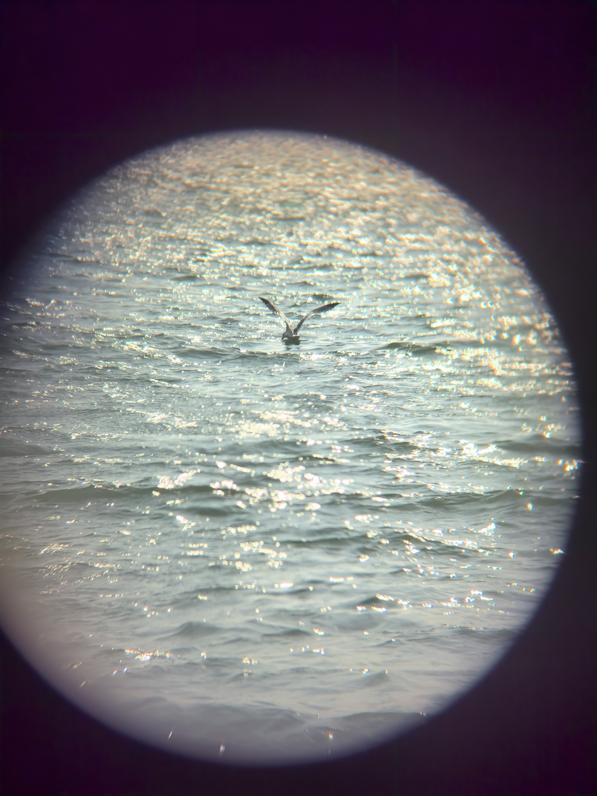
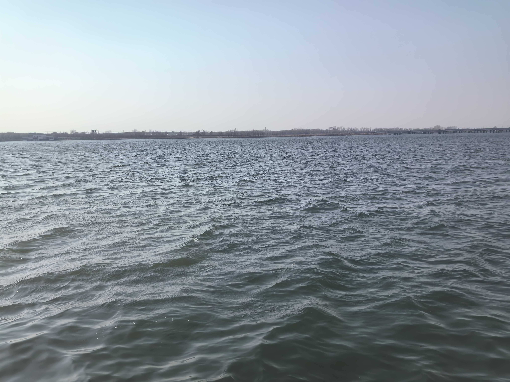
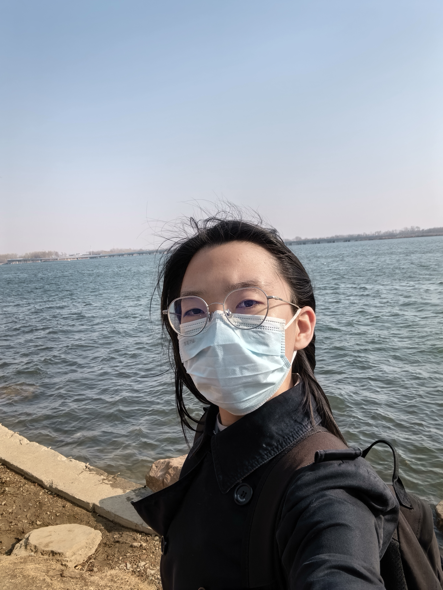
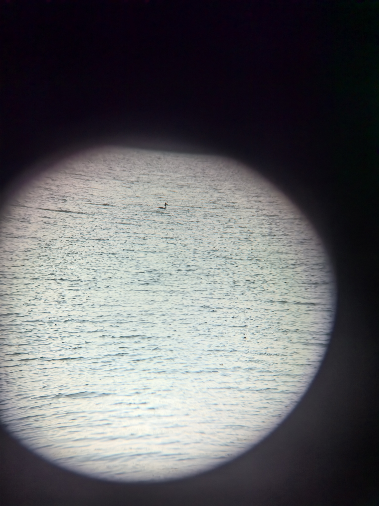
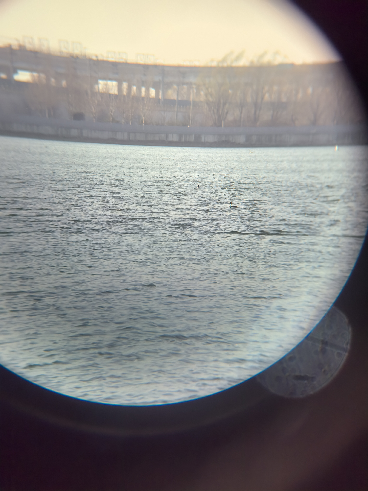
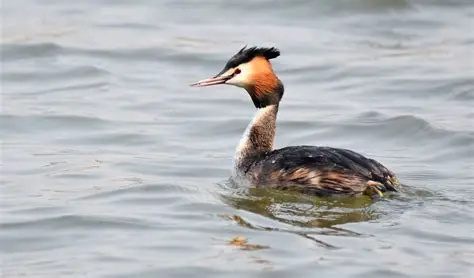
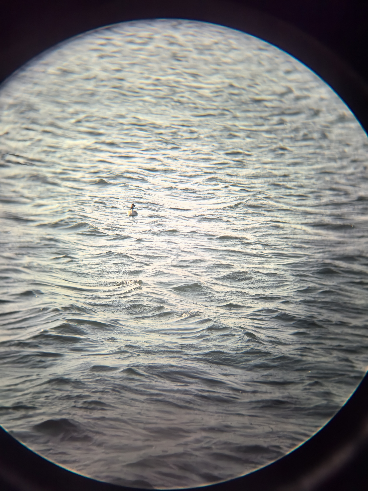

## Event Log

海鸥！还看到了海鸥们大圈找猎物小圈定位求偶社交的情况。迁徙过这里。

以及鸬鹚（鱼鹰），全身黑褐色、长脖子、体型较大，成对晃悠和捕鱼。

还有野生野鸭，感觉就是被水带着晃。

以及两只超快速啾啾啾着略过面前的领嘴雀鹎。这个时候树木刚抽芽，而且有的开花了有的没开花，温度也正好。太好了。

芦苇还没长起来。

刚刚等同步时随手一看就看到两只海鸥在湖对面飞，还好有望远镜。

凤头䴙䴘！15:39 看到了！在湖的西北？超级会潜水，在水面突然翻个没影，头顶带羽冠，看到两眼就又进水了。

还看到个海鸥降落翻起水花捕鱼未遂。

之后又看到了个黑颈䴙䴘（可能性最大）或小鸊鷉。体型和凤头鸊鷉差不多大，头顶有点白大部分是深棕色的水鸟，还没来得及仔细看它就摸鱼去了。

之后发现了更多海鸥翅膀下侧是边缘黑内侧银色，那个棕色的反而是少数派？这个少数派看来应该是红嘴鸥吧。它这个小鸟的翅膀的棕色是非常整齐的，翅膀肩部最深，之后逐渐的稍微有点淡，直到最根部才是白色的，棕色是非常整齐的一大块。亚成银鸥的棕色是斑驳的。

嗯，它这个全身都是黑的，但是嗯看起来身上没有任何嗯别的颜色的地方。嗯我看一眼，嗯确实，它刚刚翻进水里的动作嗯很快顾涌一下，但我还是看到了它额头之类的地方都没有说什么红色。是小鸊鷉……吧，还是凤头鸊鷉。那么之前那个大一点棕一点的应该是黑颈鸊鷉。小鸊鷉确实喜欢在水上待一会之后，然后就突然间翻下去一下，然后翻下去一小会之后又出来，那这个就是它了。

还抖了抖翅膀，这是凤头鸊鷉！居然！这几张应该都是它。它钻水里和抖翅膀看起来很优雅。抖翅膀看起来很优雅。

以及小鸊鷉，它迅速钻进水里脖子先下（如果算的话）闪亮亮的黑色身体在外面超可爱。

海鸥在水里漂着时看着很乖巧。

怪不得刚刚，那是一对凤头鸊鷉外加一只试图捡漏食物的小鸊鷉，附近还有若干等着捡漏的海鸥。

主体灰白、头/嘴发红、后背深色 → 红头潜鸭（雄鸟，100%确认）旁边一字排开离得非常近的四个深色小鸟比它们小一圈，有点斑驳的亚麻色感，应该是四只小鸊鷉。和红头潜鸭一起觅食来了。看到的这四个，应该就是还没完全换完繁殖羽的过渡个体，或者是亚成鸟（未成年），所以保留了冬羽的特征。正好四月初是换繁殖羽的过渡期。是换繁殖羽的过渡期。

16:29刚刚我这拿望远镜还看到了一只非常清楚的鸟。啊，头顶的黑色花冠，只有后脑勺那块稍微有点泛红棕色。整体前胸，脖子都是白的，翅膀和后背是略带斑驳的深色的，偏黑的那种。大小和凤头鸊鷉差不多好像哦居然能看得这么清楚。哦这应该就是凤头鸊鷉吧。

网图，我看到的是正面版的，超级美丽。它正面比侧面威风漂亮多了。就是没拍到只非常清楚地看到了，这份美就留给我一人独享吧。太好了，我的运气。正面看它的羽毛真的是炸开的，脖子挺着，整体外形线条流畅。

16:48 又看到大概 7 只小鸊鷉 3/4 只一组整体离得也不太远，集体觅食。这些基本上都换好繁殖羽了。萌萌小鸊鷉

还是凤头鸊鷉，不如它正脸时好看，不过这张清楚地（相对其他两张）展示了它繁殖期的红色变色以及长脖子姿态，还有冠羽。

海鸥的嗷嗷叫有点……说不上来的搞笑。啾啾啾也是。但是有时发出的长的哨声很好听。

17:02刚刚笑死我了，我看到两只海鸥一起捕鱼，其中一只叼起来一条鱼（的中段），那条鱼滑下去了，他再叼又滑下去。重复 4 次之后，他一脸无措地张着翅膀看着他的同伴，那条鱼不知道哪儿去了。合着我不仅是幸运地看到了海鸥抓鱼，还看到了鱼幸运地逃出生天。

日落的延时摄影。这个我不会上传。

风一吹还是有点冻手，准备等日落拍拍照片再回去。

待到蓝调时刻结束，拍了相当多照片。

回去需要整理下照片。好了，备份好了。
